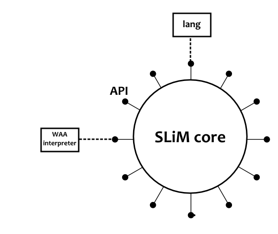

The SLiM Core
=============

SLiM core is a middleware component that is intended to be embedded in an agent 
architecture. It provides a clear API through which other modules, which are 
part of the agent architecture, can connect.
The main objective of SLiM core is *flexible collaboration between modules of an 
agent*. Hopefully, it will help us build more open agents in the sense that 
modules can be added, removed and interact in new ways over time.
It has three main roles: *symbolic data store*, *know-how* base and 
*rules base*.

Key functions of the SLiM core include:

- to manage the slim structure
- to handle all the interaction with the modules (registration, triggering, etc.)
- to perform the pattern matching

Modules (components)
--------------------

Modules have to be registered with the SLiM core in order to be able to use it
and expose their capabilities to other modules. Here is a detailed description 
of the registration process.
There is one default module called *lang* providing a language that can be used 
to manipulate the core. This language can be used through the SLiM interpreter 
or from any other code through the Do API.

.. py:currentmodule:: slim.modules

.. autoclass:: Module
   :member-order: bysource
   :members:

Patterns
--------

The `SlimCore` class
--------------------

.. py:currentmodule:: slim.core.slimcore

.. autoclass:: SlimCore
   :member-order: bysource
   :members:
